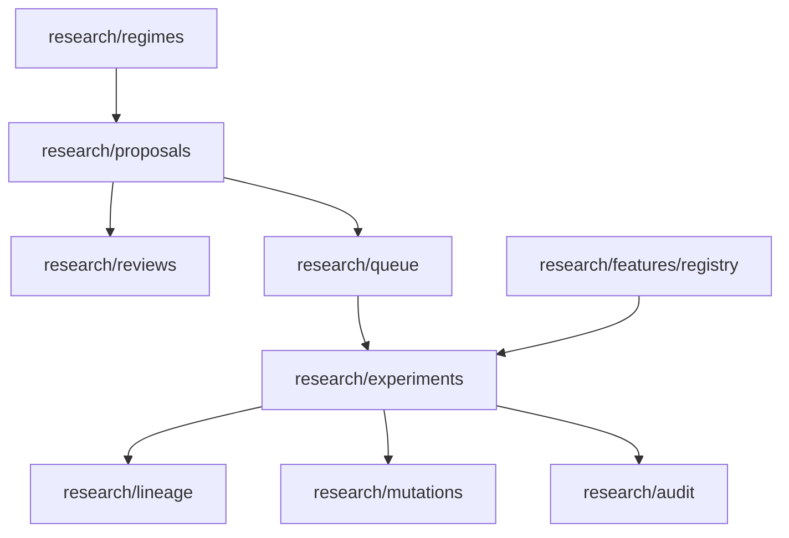

# Shark Bay Research API Audit and Expansion Plan

## Objective
This document audits the current Shark Bay API surface and proposes a migration-safe expansion plan for heavy multi-agent research usage. Scope is documentation/planning only; no runtime changes are included.

## Scope Boundaries and Safety Constraints
- Research-only API boundary is preserved.
- No trading/execution endpoints are proposed.
- No paper trading endpoints are proposed.
- No autonomous deployment controls are proposed.
- Deterministic validation and reproducibility are treated as first-class requirements.

---

## 1) Current API Surface Audit

## Current endpoint map (grouped)

### Health and operations
- `GET /health`
- `GET /health/live`
- `GET /health/ready`
- `GET /ops/health`
- `GET /ops/infrastructure`
- `GET /metrics`

### Market data and ingestion
- `GET /symbols/active`
- `GET /candles`
- `GET /ingestion/status`
- `GET /ingestion/telemetry`

### Strategy metadata
- `GET /strategies`
- `GET /strategies/registry`

### Backtests
- `GET /backtests`
- `GET /backtests/{run_id}`
- `GET /backtests/{run_id}/fills`
- `GET /backtests/{run_id}/equity-curve`
- `POST /backtests/run`

### Research features, experiments, analytics, splits, walk-forward, agent outputs
- `GET /research/features`
- `GET /research/experiments/run`
- `GET /research/experiments/latest`
- `GET /research/experiments/{experiment_id}`
- `GET /research/experiments/{experiment_id}/equity-curve`
- `GET /research/experiments/{experiment_id}/fills`
- `GET /research/analytics`
- `GET /research/dataset/splits`
- `GET /research/walk-forward/run`
- `GET /research/agent/recommendations`
- `POST /research/backfill/rest`

## Strengths
- Strong research boundary orientation: current research endpoints are focused on analytics/backtests/features, not execution.
- Existing deterministic hooks: `config_hash`, `dataset_fingerprint`, and explicit run identifiers provide a good baseline for reproducibility.
- Broad foundational coverage already exists across features, experiments, splits, walk-forward, and agent recommendations.

## Weaknesses and consistency issues

### Endpoint semantics
- Mutating actions on GET routes (`/research/experiments/run`, `/research/walk-forward/run`) violate HTTP expectations and complicate caching/retry behavior.
- Naming style is mixed: nouns (`/backtests`) and verbs (`/run`) coexist.

### Response envelope consistency
- Some endpoints return lists directly (e.g., `/backtests` response model list), while others wrap in object envelopes (`{"experiments": [...]}`).
- Error payloads rely mostly on `{"detail": ...}` without a structured error code taxonomy.

### Pagination/filtering/sorting
- Most list endpoints expose only `limit` and lack cursor-based pagination.
- Missing standard filters for status/date window/config hash/strategy params across experiments and backtests.
- Sorting controls are not explicitly user-defined.

### Metadata and deterministic identifiers
- No universal metadata envelope (`request_id`, `api_version`, `generated_at`, `next_cursor`).
- Deterministic metadata appears in some domains (backtests/experiments) but not uniformly across analytics and agent outputs.
- No explicit idempotency contract for “run” endpoints.

### Agent workflow support gaps
- No queue/job abstraction for long research workloads.
- No lineage graph endpoint connecting strategy spec -> experiment set -> analytics summary -> recommendation.
- No shared annotation/tagging/search surface for multi-agent collaboration.

## Focused domain audit

### Experiments
- Present: run/latest/detail/fills/equity-curve.
- Missing: search, tags, lifecycle states, lineage, mutation trail, replay snapshot abstraction.

### Walk-forward
- Present: direct run endpoint.
- Missing: persisted walk-forward run index/history, comparison views, deterministic snapshot reference IDs.

### Analytics
- Present: aggregate analytics endpoint.
- Missing: parameterized metric sets, compare mode, benchmark anchors, export schema metadata.

### Strategy registry
- Present: list + basic filters.
- Missing: versioning, compatibility matrix, deprecation status transitions, strategy documentation linkage.

### Ingestion telemetry
- Present: status + symbol-level telemetry.
- Missing: historical telemetry windows, interval rollups, anomaly flags, ingestion event log queries.

### Research agent outputs
- Present: recommendations endpoint.
- Missing: run IDs, provenance references, prompt/config hashes, approval state, and reproducible artifact references.

---

## 2) API Architecture Assessment

## Scaling concerns
- Synchronous run-style endpoints will become bottlenecks under multi-agent concurrency.
- Lack of queue/state endpoints makes orchestration polling inefficient and duplicate-prone.
- Missing stable cursor pagination creates expensive repeated scans at scale.

## Agent workflow concerns
- Strategist/Developer/Auditor agents will need shared lifecycle states and lineage; current API is mostly point-query oriented.
- No explicit lock/claim/lease model for agent task ownership.
- No first-class audit event stream for who did what, when, and based on which dataset snapshot.

## Deterministic guarantees: current vs required

### Current baseline
- Deterministic elements exist (`config_hash`, `dataset_fingerprint`).

### Required future guarantees
- Every derived artifact should reference: `dataset_snapshot_id`, `code_revision`, `strategy_spec_version`, `feature_set_version`, `seed` (when applicable), and `created_by_agent`.
- Replay endpoint should reconstruct prior run inputs exactly and expose mismatch reasons if reproducibility fails.

## Missing abstractions
- Research proposal lifecycle abstraction.
- Experiment queue/job abstraction.
- Lineage abstraction.
- Mutation history abstraction.
- Research notes/documents abstraction.
- Approval/review abstraction.

---

## 3) Proposed Missing APIs (Proposal Only)

## Proposed new groups
- `/research/proposals`
- `/research/reviews`
- `/research/lineage`
- `/research/mutations`
- `/research/audit`
- `/research/queue`
- `/research/regimes`
- `/research/features/registry`

## Suggested endpoint candidates

### Proposals and reviews
- `POST /research/proposals`
- `GET /research/proposals`
- `GET /research/proposals/{proposal_id}`
- `PATCH /research/proposals/{proposal_id}`
- `POST /research/reviews`
- `GET /research/reviews?proposal_id=...`

### Queue and lifecycle
- `POST /research/queue/jobs`
- `GET /research/queue/jobs`
- `GET /research/queue/jobs/{job_id}`
- `POST /research/queue/jobs/{job_id}/cancel`

### Lineage and mutations
- `GET /research/lineage/{artifact_id}`
- `GET /research/mutations?experiment_id=...`
- `GET /research/experiments/{experiment_id}/replay-snapshot`

### Audit and activity
- `GET /research/audit/events`
- `GET /research/audit/agents/{agent_id}/activity`

### Registries
- `GET /research/features/registry`
- `GET /research/regimes`

### Search, compare, and tagging
- `GET /research/experiments/search`
- `POST /research/experiments/{experiment_id}/tags`
- `GET /research/experiments/compare?ids=...`
- `GET /research/experiments/{experiment_id}/failure-analysis`

---

## 4) API Design Standards (Recommended)

## Naming
- Resource-first nouns; avoid verb-heavy paths.
- Use sub-resources for actions (`/jobs/{id}/cancel`) only when no pure-state alternative exists.

## Pagination
- Standard cursor pagination envelope:
  - `data: []`
  - `page: {next_cursor, prev_cursor, has_more, limit}`

## Filtering and sorting
- Common query fields: `status`, `created_after`, `created_before`, `strategy`, `symbol`, `interval`, `tag`, `agent_id`.
- Sorting contract: `sort_by`, `sort_order` with documented defaults.

## Deterministic identifiers
- Use UUIDv7 (or equivalent time-sortable ID) for entity IDs.
- Preserve immutable deterministic fields:
  - `config_hash`
  - `dataset_fingerprint`
  - `dataset_snapshot_id`
  - `strategy_spec_version`
  - `feature_set_version`
  - `code_revision`

## Timestamp formats
- RFC 3339 UTC only (e.g., `2026-05-15T00:00:00Z`).

## Error payloads
- Standard shape:
  - `error.code`
  - `error.message`
  - `error.details`
  - `error.retryable`
  - `error.request_id`

## Metadata fields
- Response envelope metadata:
  - `request_id`
  - `generated_at`
  - `api_version`
  - `deterministic_context` object (when relevant)

## Idempotency
- Require idempotency keys for mutation endpoints (`POST/PATCH`).
- Define replay-safe semantics for job submission and proposal creation.

---

## 5) Agent-Oriented Workflow Analysis

## Merlin (Strategist)
Likely needs:
- proposal creation/revision,
- cross-experiment comparisons,
- regime-linked discovery,
- read-only performance narratives.

Current bottlenecks:
- no proposal lifecycle API,
- no first-class compare/search/tag endpoints,
- recommendation outputs lack full provenance envelope.

## Gawain (Developer)
Likely needs:
- deterministic experiment submission,
- queue tracking,
- failure analysis and mutation logs,
- feature/strategy version compatibility checks.

Current bottlenecks:
- run endpoints are synchronous and GET-based,
- no queue/state abstraction,
- no mutation history endpoint.

## Bedivere (Auditor)
Likely needs:
- audit event retrieval,
- reproducibility replay snapshots,
- review/approval traceability,
- holdout safety attestations.

Current bottlenecks:
- no audit log API,
- no standardized deterministic context in all responses,
- no approval workflow state machine.

## Unsafe patterns to avoid
- Coupling agent behavior to undocumented response fields.
- Polling high-cost endpoints without cursor/state tokens.
- Inferring deterministic equivalence without explicit snapshot IDs.

---

## 6) Future API Group Recommendations

Group intent summary:
- `/research/proposals`: idea/spec lifecycle.
- `/research/reviews`: approvals, comments, state transitions.
- `/research/lineage`: parent-child artifact graph.
- `/research/mutations`: parameter/code/data mutation log.
- `/research/audit`: immutable compliance/event history.
- `/research/queue`: async deterministic job orchestration.
- `/research/regimes`: market regime catalog metadata.
- `/research/features/registry`: feature definitions + versions.

---

## 7) Safety Analysis

All proposals above preserve:
- Research-only operation (no order placement routes).
- Deterministic validation requirements (snapshot/version/hash metadata).
- No paper trading scope expansion.
- No autonomous deployment pathways.
- No hidden holdout leakage (explicit include/exclude controls, auditable access events).

Recommended additional safety controls:
- Holdout access policy in API metadata and audit log.
- Per-endpoint role capability matrix for agents.
- Explicit `safety_scope: research_only` in response metadata for research groups.

---

## 8) Migration-Safe Phased Roadmap

## Phase 0: Standardization
- Add API design conventions doc and response envelope policy.
- Introduce consistent error schema and request IDs.

## Phase 1: Read-only discovery improvements
- Add experiment search/filter/sort/compare/tag read endpoints.
- Add registries for features/regimes (read-only first).

## Phase 2: Deterministic lifecycle foundation
- Add proposal/review models and endpoints.
- Add lineage + mutation history surfaces.

## Phase 3: Orchestration scale
- Add queue/job APIs with idempotent submission and deterministic job context.
- Add audit event APIs and agent activity logs.

## Phase 4: Replay and compliance hardening
- Add deterministic replay-snapshot endpoints.
- Add approval gates and holdout-access attestations.

---

## 9) Recommended Next API Milestones

Priority ordered by impact, safety, and multi-agent orchestration value:
1. **Standard response envelope + error schema + request IDs** (cross-cutting reliability).
2. **Experiment search/compare/tag endpoints** (immediate Strategist/Developer productivity).
3. **Research queue/job lifecycle endpoints** (scaling under concurrent agent load).
4. **Lineage + mutation history endpoints** (deterministic traceability).
5. **Audit + agent activity endpoints** (Auditor confidence and governance).
6. **Proposal/review workflow endpoints** (human/agent coordination maturity).
7. **Replay snapshot endpoint** (deep reproducibility guarantees).

Each milestone should be shipped as additive, backward-compatible API evolution with explicit versioning notes and no expansion into execution/trading domains.
