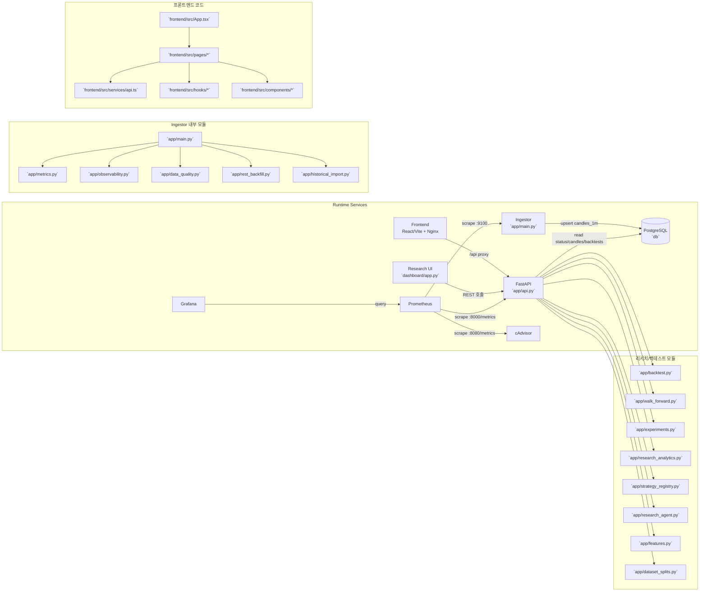

# 코드베이스 그래프 (Shark Bay)

아래 그래프는 현재 레포의 주요 실행 컴포넌트와 코드 모듈 간의 관계를 요약합니다.

## 빠른 읽기
- **수집 경로**: Binance(외부) → `ingestor`(`app/main.py`) → PostgreSQL.
- **조회 경로**: Frontend/Research UI → FastAPI(`app/api.py`) → PostgreSQL.
- **관측 경로**: API/ingestor/cAdvisor → Prometheus → Grafana.
- **분석 경로**: FastAPI가 백테스트/실험/전략/리서치 모듈을 조합해 결과를 API로 노출.

## 보는 방법 (PC/모바일)
- **GitHub 웹/앱에서 바로 보기**: `docs/code_graph.md`를 열면 Mermaid 블록이 지원되는 뷰어에서 그래프로 렌더링됩니다.
- **모바일 가능 여부**: 네, 가능합니다. 다만 화면이 좁아 노드가 작게 보일 수 있으니 **가로 모드** 또는 **핀치 줌**을 권장합니다.
- **렌더링이 안 보일 때**: Mermaid 미지원 뷰어에서는 코드 블록으로 보일 수 있습니다. 이 경우 GitHub 웹 브라우저(데스크톱 모드)에서 열거나, Mermaid Live Editor에 본문을 붙여넣어 확인하세요.
- **빠른 대안**: 하단의 `빠른 읽기` 섹션만 봐도 전체 데이터/서비스 흐름을 텍스트로 파악할 수 있습니다.
