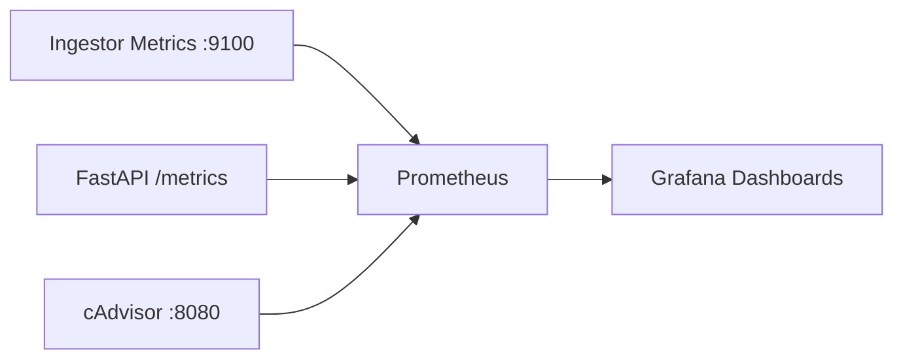
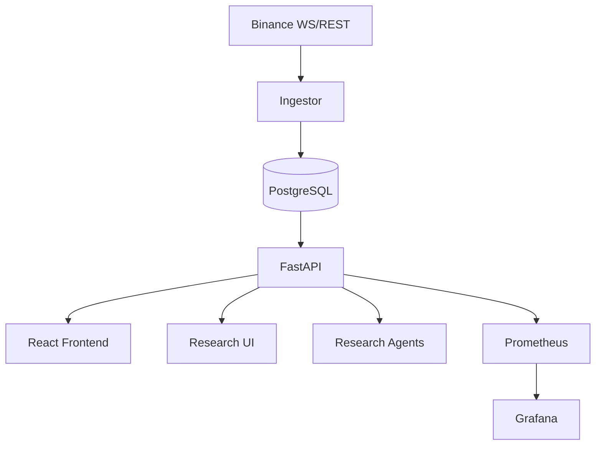

# Shark Bay Codebase Whitepaper

## 1) System Purpose
Shark Bay is a **research-first market data and quantitative experimentation platform**. Its primary objective is to provide deterministic, inspectable workflows for ingestion, feature generation, backtesting, walk-forward validation, and research analytics over 1-minute candle data. No live/paper execution path is part of the current architecture.

## 2) Research-Only Boundaries
- Supported market data interval for core research flows is currently `1m`.
- The API and engines provide **simulation/backtest only** workflows.
- Strategy registry entries are metadata + research contracts; they are not executable order-routing policies.
- The repository intentionally excludes brokerage, portfolio accounting, order lifecycle management, and autonomous deployment control.

## 3) Deterministic Validation Philosophy
Shark Bay enforces repeatable outcomes by:
- pinning strategy parameter validation before execution,
- hashing configs and dataset fingerprints for run traceability,
- ordering candle reads by ascending `open_time`,
- using explicit split/window generation for train/validation/test regimes,
- persisting experiment and backtest artifacts with immutable identifiers.

## 4) Service Layout
Core services (Compose):
- `db` (PostgreSQL): canonical candle + research state.
- `ingestor`: Binance REST+websocket ingestion, schema init, quality counters, heartbeat.
- `api` (FastAPI): research and observability endpoints.
- `research-ui` (Streamlit): read-only backtest explorer.
- `frontend` (React/Nginx): operational + research console.
- `prometheus`, `grafana`, `cadvisor`: observability stack.

## 5) Docker Architecture
- `ingestor` and `api` are built from `./app` and depend on healthy Postgres.
- Frontend is static build + Nginx reverse proxy to `/api`.
- Prometheus scrapes API, ingestor exporter, and cAdvisor.
- Grafana is provisioned by filesystem configs and stores state in volume.

## 6) Database Role
Postgres is the source of truth for:
- `candles_1m` via idempotent upserts (`symbol`,`open_time` key),
- ingestion heartbeat and status telemetry,
- backtest run metadata + fills/equity artifacts,
- research experiment records and derived analytics inputs.

## 7) Ingestion Pipeline
Ingestion responsibilities:
1. initialize schema,
2. parse configured symbol list,
3. maintain combined stream URL + reconnect accounting,
4. validate OHLC/volume/time sanity,
5. upsert candles idempotently,
6. perform bounded forward gap recovery via REST when enabled,
7. emit ingestion and quality metrics.

## 8) Websocket Ingestion
- Combined stream topology is used for multi-symbol ingestion.
- Reconnect counters are tracked globally and per symbol metric labels.
- Data quality guards detect malformed OHLC, non-positive volume, and future timestamps.

## 9) REST Backfill / Import Flow
Two paths exist:
- **Automatic gap recovery** at ingestor startup (bounded, forward-only, capped by env limits).
- **Manual research backfill endpoint** (`/research/backfill/rest`) for controlled historical recovery with dry-run support.
- **Bulk import utility** (`import_binance_klines.py`) validates and upserts CSV/ZIP historical dumps.

## 10) API Layer
FastAPI exposes:
- health/liveness/readiness,
- ingestion status and telemetry,
- candle retrieval,
- strategy metadata,
- backtests and persisted run artifacts,
- research features/experiments/analytics/splits/walk-forward,
- research agent recommendation endpoint,
- Prometheus metrics endpoint.

## 11) Frontend Layer
- React frontend provides operations, market data, strategy, research, and infrastructure views.
- Streamlit `research-ui` focuses on deterministic backtest result exploration.

## 12) Research Layer
Research modules include:
- `features.py` for feature snapshot computation,
- `experiments.py` for experiment execution + persistence,
- `dataset_splits.py` for deterministic date/window splits,
- `walk_forward.py` for rolling segment evaluation,
- `research_analytics.py` for aggregate analytics payloads.

## 13) Strategy Registry
Two distinct strategy constructs coexist:
- Runtime backtest strategy implementations in `backtest.py` (indicator/position logic).
- Research metadata registry in `strategy_registry.py` (strategy contracts, features, risk profile, intended regime).

## 14) Backtest Engine
`SimulatedExecutionModel` and repositories in `backtest.py` provide:
- deterministic candle replay,
- position transitions from strategy signals,
- result summaries + fills + equity curve persistence,
- config hash and dataset fingerprint traceability.

## 15) Walk-Forward Engine
`walk_forward.py` composes deterministic windows and computes segment metrics across train/validation/test slices, then emits aggregate degradation and pass/fail heuristics.

## 16) Telemetry/Metrics
Metrics cover ingestion, data quality, backfill behavior, DB connectivity, and API request telemetry. Prometheus scrape + Grafana dashboards provide visibility over system and container health.

## 17) Observability Stack

## 18) Runtime Data Flow

## 19) Failure Boundaries
- External API/network failures are isolated to ingestion/backfill paths.
- DB failures propagate as API `500` or readiness `503`.
- Missing experiment/run IDs return `404`.
- Strategy/interval/range validation errors return `400`.

## 20) Idempotency Expectations
- Candle writes are upsert-based and safe for duplicate ingestion.
- Backfill operations are repeatable with `skip_existing`/upsert semantics.
- Experiment persistence is keyed by `experiment_id`; upsert updates canonical record.

## 21) Symbol Handling
- Symbols are normalized uppercase and deduplicated.
- Active symbols derive from DB distinct values.
- Registry-based strategy compatibility gates symbol/interval combinations.

## 22) Current Scaling Assumptions
- 1-minute bars only.
- Moderate symbol sets (default top majors) over one combined stream.
- Single ingestor process with direct DB writes.
- API synchronous request model with DB-backed analytics.

## 23) Safety Guarantees
- No trading/execution side effects.
- Deterministic, reproducible research outputs constrained by dataset and config hash.
- Explicit validation guards for intervals, symbols, ranges, and strategy constraints.

## 24) Documentation Entry Points
- Project structure graph: `docs/project_structure_graph.md`
- Agent workflow runbook: `docs/GUIDE_AGENTS.md`
- API reference: `docs/research_api_reference.md`
- Debugging workflows: `docs/agent_debugging.md`

Recommended onboarding order:
1. `README.md`
2. `docs/project_structure_graph.md`
3. `docs/research_api_reference.md`
4. `docs/GUIDE_AGENTS.md`
