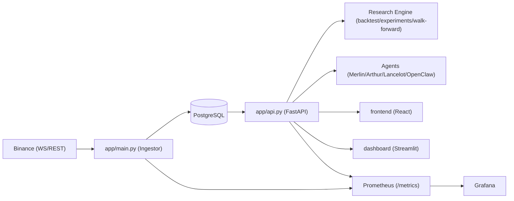

# Shark Bay Project Structure Graph

This map is optimized for agent onboarding and API/research navigation.

## High-level Tree

```text
shark_bay/
├─ app/                         # Core Python services (ingestor + API + research engine)
│  ├─ main.py                   # Ingestor entrypoint (WS/REST, quality checks, upsert)
│  ├─ api.py                    # FastAPI research/ops endpoints
│  ├─ backtest.py               # Deterministic execution engine + repositories
│  ├─ backtest_jobs.py          # Async backtest job queue contracts
│  ├─ backtest_worker.py        # Job worker process
│  ├─ experiments.py            # Experiment run/persistence
│  ├─ research_agent.py         # Recommendation and research-agent routines
│  ├─ dataset_splits.py         # Train/validation/test split logic
│  ├─ walk_forward.py           # Walk-forward evaluation
│  ├─ strategy_registry.py      # Research strategy metadata registry
│  ├─ strategy_lifecycle.py     # Strategy proposal lifecycle state machine
│  ├─ reviews.py                # Research review persistence
│  ├─ metrics.py                # Prometheus metrics definitions
│  ├─ schema.sql                # Base DB schema
│  └─ migrations/               # Incremental SQL migrations
├─ frontend/                    # React + Vite operations/research UI
│  ├─ src/services/api.ts       # Frontend API client definitions
│  ├─ src/pages/                # Console pages (ops/research/agents/risk/infra)
│  └─ nginx.conf                # Reverse proxy for /api
├─ dashboard/                   # Streamlit dashboard
├─ observability/               # Prometheus + Grafana provisioning
├─ strategies/builtin/          # Python strategy implementations
├─ tests/                       # Unit/integration test suite
├─ docs/                        # Whitepaper, API refs, agent runbooks
├─ docker-compose.yml           # Local full-stack topology
└─ README.md                    # Primary entrypoint
```

## Component Relationship Graph



## Docs Navigation (Recommended Read Order)

1. `README.md`: runtime setup and service topology.
2. `docs/codebase_whitepaper.md`: system boundaries and deterministic design.
3. `docs/research_api_reference.md`: endpoint contracts.
4. `docs/GUIDE_AGENTS.md`: agent workflows and task templates.
5. `docs/agent_debugging.md`: troubleshooting patterns.

## Notes

- Generated artifacts and dependencies (for example `frontend/node_modules`, `frontend/dist`, `backtest_results`) are intentionally excluded from the graph.
- Keep this file updated when adding new top-level services/modules that agents should call directly.
